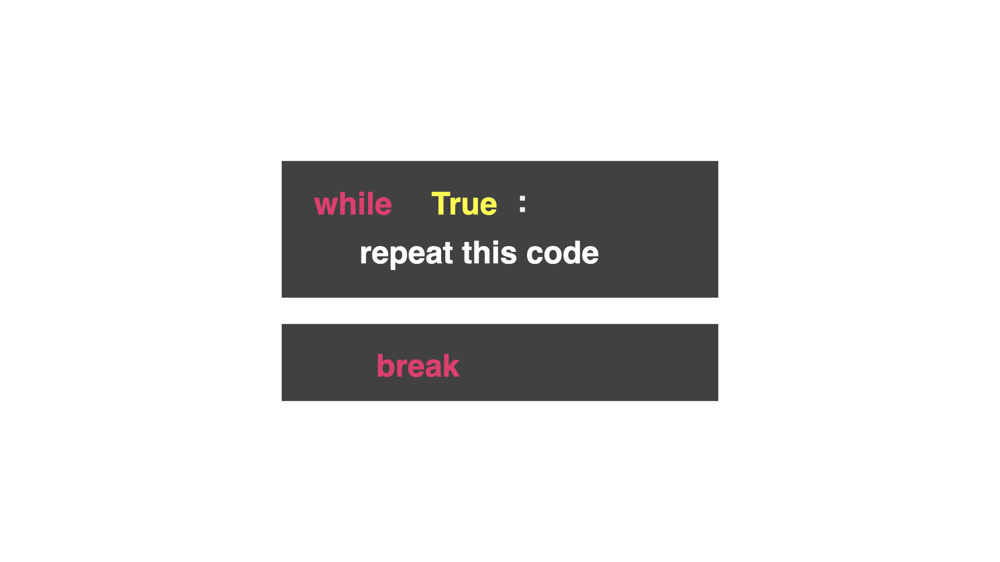

# Another Cheat

So far we've used `break` in the `while True` loop. `break` leaves the loop completely *and* runs the next unindented line of code. However, you may want to stop the code and start the loop from the top again. (This is ideal for building games!)




In the code below, the game runs and the user is asked if they want to go left or right. If the user chooses left, they fall to their death, and `break` will kick the user out of the loop. That's the game.

```python
while True:
  print("You are in a corridor, do you go left or right?")
  direction = input("> ")
  if direction == "left":
    print("You have fallen to your death")
    break
 ```

### Well that's a bit lame and not any different than what we learned in day 16...now for the cheat.

