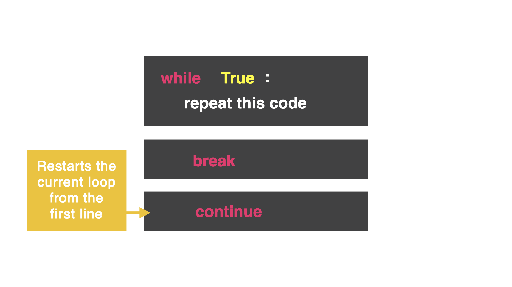

# The Continue Command

The `continue` command stops executing code in the loop and starts at the top of the loop again. Essentially, we want to kick the user back to the original question.




Adding `continue` will start the code from the start and ask the first question again: "Do you go left or right?".

```python
while True:
  print("You are in a corridor, do you go left or right?")
  direction = input("> ")
  if direction == "left":
    print("You have fallen to your death")
    break
  elif direction == "right":
    continue
  else:
    print("Ahh! You're a genius, you've won")
```

The `else` statement refers to any input besides left or right (up or esc). Since the user is a winner, we do *not* want to use `break` or it would say they have failed.


### So how do we make it stop?