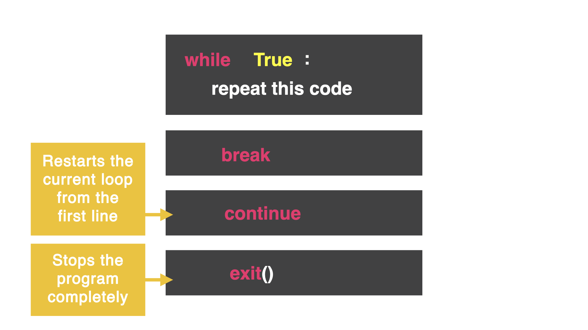

# Proceed to the Nearest Exit

The previous code continues to loop even after the user has won. Let's fix that with the `exit()` command



The `exit()` command completely stops the program and it will not run any more lines of code.

## 👉 Copy all the code and try it out. Does it do what you expected?
```python
while True:
  print("You are in a corridor, do you go left or right?")
  direction = input("> ")
  if direction == "left":
    print("You have fallen to your death")
    break
  elif direction == "right":
    continue
  else:
    print("Ahh! You're a genius, you've won")
    exit()
print("The game is over, you've failed!")
```

